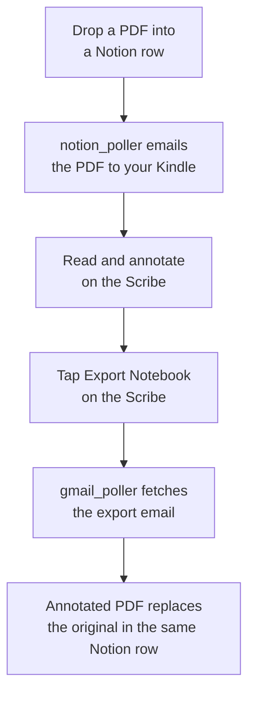

## Note: this is completely vibe coded!!! I don't take any responsiblity for the quality of this project. The idea is just something I've been wanting to implement for a few years and finally had a moment to do so. I figured someone else might have the same problem so I thought I'd make the repo public. Hope it works for you too!!! 

# Kindle-Notion Sync

Sync PDFs between a Notion database and a Kindle Scribe. PDFs added to Notion are emailed to the Scribe; annotated PDFs returned via Kindle's "Export Notebook" feature are matched back to their Notion row and uploaded to replace the original.

## How it works



> **Status:** Phases 2–4 functional (outbound, inbound, always-on). See [PLAN.md](PLAN.md) for the phased build plan.

## Architecture

- Python 3.13, managed by [uv](https://github.com/astral-sh/uv)
- Notion API for database operations and the File Upload API for storing annotated PDFs
- Gmail API (OAuth 2.0) for sending to Kindle and reading export emails back
- Ghostscript for compressing oversized PDFs before send

## Prerequisites

- **[uv](https://github.com/astral-sh/uv)** — install with `curl -LsSf https://astral.sh/uv/install.sh | sh` (macOS/Linux) or `brew install uv`. Will auto-install Python 3.13 if you don't have it.
- **Ghostscript** — only required if you'll send PDFs over 18 MB.
  - macOS: `brew install ghostscript`
  - Debian/Ubuntu: `sudo apt install ghostscript`
  - Other: [ghostscript.com](https://www.ghostscript.com/)

## Setup

### 1. Clone and install Python deps

```bash
git clone <this-repo-url>
cd notion-kindle-sync
uv sync
```

`uv sync` reads `pyproject.toml` + `uv.lock` and creates `.venv/` with exact dependency versions.

### 2. Get your credentials

Walk through [Phase 1 of PLAN.md](PLAN.md#phase-1-account-setup-and-credentials-45-minutes) — it covers all of this in detail. You'll end up with:

- `credentials.json` in the project root (Gmail OAuth client, downloaded from Google Cloud Console)
- A Notion integration token and database ID
- Your Kindle email address (from Amazon's Personal Document Settings)
- Your Gmail address added to Amazon's Approved Personal Document Email List

### 3. Create your `.env`

```bash
cp .env.example .env
```

Open `.env` and fill in the five values. Comments inside the file describe each one.

### 4. Verify

```bash
uv run python check_setup.py
```

Five `[OK]` lines means you're good. Anything `[FAIL]` tells you exactly what's wrong.

## Usage

### Run the full sync (recommended)

```bash
uv run python main.py
```

Polls Notion and Gmail every 60s. Rows with `Status = "New"` and a PDF attached get sent to your Scribe; annotated PDFs returned via Export Notebook are matched back to their original row and uploaded into Notion's storage. Logs to stdout and `sync.log`. Ctrl+C to stop.

To make this auto-start on login, see [Run as a launchd agent](#run-as-a-launchd-agent-macos) below.

### One-off operations (debugging)

```bash
uv run python send_to_kindle.py path/to/file.pdf  # send a single PDF to Kindle
uv run python notion_poller.py                    # outbound polling only
uv run python gmail_poller.py                     # inbound, single cycle then exit
```

The first Gmail-related run pops a browser for OAuth consent and creates `token.json`; subsequent runs are silent. PDFs over 18 MB are auto-compressed with Ghostscript before sending.

## Run as a launchd agent (macOS)

To run `main.py` automatically at login (and restart it if it dies), install the launchd agent. The install script generates a plist tailored to your machine — your username, home directory, project path, and `uv` location — and writes it to `~/Library/LaunchAgents/`. Nothing personal lands in the repo.

```bash
./setup_launchd.sh
```

To stop and remove:

```bash
./uninstall_launchd.sh
```

Where to find logs:

- **App events** (downloads, uploads, page updates, caught errors): `sync.log` in the project directory.
- **launchd stdout/stderr** (only useful if `main.py` crashed before the app could log): `launchd.out.log` / `launchd.err.log` in the project directory.

To verify the agent is running:

```bash
launchctl list | grep kindle-notion-sync
```

## Project layout

| File | Purpose |
|------|---------|
| `main.py` | Combined sync loop — outbound + inbound. The everyday entry point. |
| `notion_poller.py` | Outbound poll: send "New" rows from Notion to Kindle. |
| `gmail_poller.py` | Inbound poll: pull export emails, attach annotated PDFs to Notion. |
| `send_to_kindle.py` | Send a single PDF to Kindle via Gmail API. CLI + importable. |
| `gmail_auth.py` | Shared Gmail OAuth credentials (gmail.send + gmail.modify scopes). |
| `check_setup.py` | Sanity-check `.env`, `credentials.json`, and Notion connection. |
| `setup_launchd.sh` / `uninstall_launchd.sh` | Install / remove the launchd agent for auto-start on macOS. |
| `pyproject.toml` | Python dependency declarations. |
| `uv.lock` | Pinned dependency versions for reproducible installs. |
| `.python-version` | Pins Python 3.13 for `uv`. |
| `.env.example` | Template for `.env` (the real `.env` is gitignored). |
| `CLAUDE.md` | Project conventions, intended for AI-assisted development. |
| `PLAN.md` | Phased build plan. |

Files generated at runtime (all gitignored): `.env`, `credentials.json`, `token.json`, `sync.log`, `launchd.out.log`, `launchd.err.log`, `.venv/`.

## License

See [LICENSE](LICENSE).
